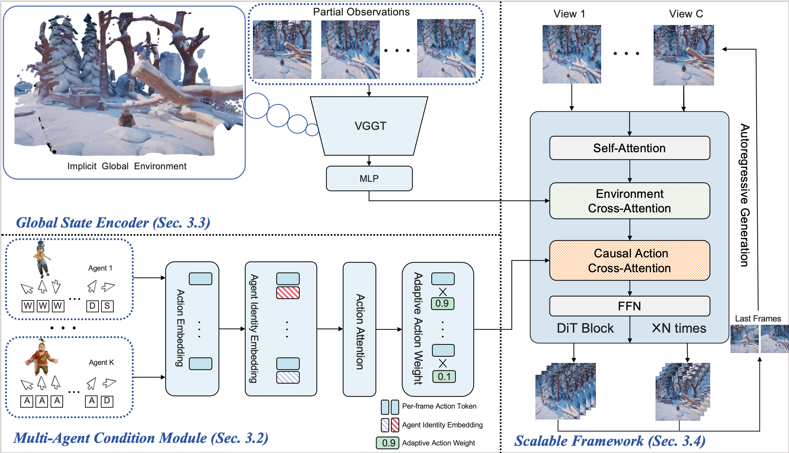

<div align="center">

<h1>MultiWorld: Scalable Multi-Agent Multi-View Video World Models </h1>
<a href="https://arxiv.org/abs/2604.18564">
</a>
<a href="https://Multi-World.github.io/">
</a>

<a href="https://huggingface.co/datasets/Haoyuwu/MultiWorldData">
</a>
<a href="https://modelscope.cn/datasets/HaoyuWuRUC/MultiWorldData">
</a>
<a href="https://github.com/CIntellifusion/MultiWorld">
</a>

[Haoyu Wu](https://cintellifusion.github.io/)$^{1*}$, [Jiwen Yu](https://yujiwen.github.io/) $^{1}$, [Yingtian Zou](https://scholar.google.com/citations?user=APA-glsAAAAJ&hl=en)$^{2}$, [Xihui Liu](https://xh-liu.github.io/) $^{1}†$

$^1$ The University of Hong Kong $^2$ SReal AI

(† Corresponding Author)

</div>


## 🎯 Overview 



We present **MultiWorld**, a unified framework for multi-agent multi-view world modeling that enables accurate control of multiple agents while maintaining multi-view consistency.

In the Multi-Agent Condition Module (Sec. 3.2), Agent Identity Embedding and Adaptive Action Weighting are employed to achieve multi-agent controllability. In the Global State Encoder (Sec. 3.3), we use a frozen VGGT backbone to extract implicit 3D global environmental information from partial observations, thereby improving multi-view consistency. MultiWorld scales effectively across varying agent counts and camera views, supporting autoregressive inference to generate beyond the training context length (Sec. 3.4).


## 🚀 News

- [2026/5/11] Training code available. Long-term inference Code available.
- [2026/4/21] Paper,code,data and project page are available. Welcome to have a try. 


## Setup Environments 

```shell
conda create -n multiworld python=3.13 
conda activate multiworld
# install torch 
pip install torch==2.7.1 torchvision==0.22.1 torchaudio==2.7.1 \
    --index-url https://download.pytorch.org/whl/cu128

pip install -r requirements.txt
```

### Dataset Download

MultiWorld release contains two parts: **It Takes Two** game videos and **Robotics** videos.  
All `.tar` archives are stored flat in the same dataset repository.

#### ModelScope Download

```bash
modelscope login <YOUR_API_KEY>
modelscope download --dataset HaoyuWuRUC/MultiWorldData \
    --local_dir ./data
bash preprocess/untar_chunks.sh
```

#### HuggingFace Download

```bash
hf auth login
hf download Haoyuwu/MultiWorldData --repo-type dataset \
    --local-dir ./data
bash preprocess/untar_chunks.sh
```

After running `preprocess/untar_chunks.sh`, the archives are extracted to:
- `data/ittakestwo_release/` — It Takes Two dataset
- `data/robots_release/` — Robotics dataset

### Checkpoint Download 

```bash 
modelscope login <YOUR_API_KEY>
modelscope download --model HaoyuWuRUC/MultiWorldCheckpoint \
    multiworld_480p_fulldata.safetensors --local_dir ./checkpoints
modelscope download --model HaoyuWuRUC/MultiWorldCheckpoint \
    multiworld_480p_toydata.safetensors --local_dir ./checkpoints
modelscope download --model HaoyuWuRUC/MultiWorldCheckpoint \
    multiworld_320p_robots.safetensors --local_dir ./checkpoints
```

```bash
hf auth login
hf download Haoyuwu/MultiWorldCheckpoint multiworld_480p_fulldata.safetensors --local-dir ./checkpoints --repo-type model
hf download Haoyuwu/MultiWorldCheckpoint multiworld_480p_toydata.safetensors --local-dir ./checkpoints --repo-type model
hf download Haoyuwu/MultiWorldCheckpoint multiworld_320p_robots.safetensors --local-dir ./checkpoints --repo-type model
```

## Training

To train MultiWorld on the full It Takes Two dataset:

```shell
bash ittakestwo/scripts/train.sh ittakestwo/configs/train_ua_480P_toy.yaml train_480P
```

- `config_path`: Path to the training config (e.g., `train_ua_480P_toy.yaml` for 480p two-agent setting).
- `output_path`: Experiment outputs (checkpoints, logs, eval videos) are saved to `outputs/<EXP_NAME>/`.
- The script uses `accelerate launch` for distributed training. Adjust `nproc_per_node` in your `accelerate` config as needed.

## Inference

For non-autoregressive inference, left/right view videos are **automatically concatenated** side-by-side after generation. The `gen/` and `gt/` directories will already contain the final concatenated outputs when inference finishes.

### It Takes Two

Inference checkpoint trained on full dataset:
```shell
python -m torch.distributed.run --nproc_per_node=8 \
    ittakestwo/parallel_inference.py \
    --inference-seed 0 \
    --num-inference-steps 50 \
    --config-path ittakestwo/configs/inference_480P_full.yaml \
    --model-path checkpoints/multiworld_480p_fulldata.safetensors \
    --output-dir outputs/eval_480P_full 
```

Inference checkpoint trained on toy dataset:
```shell
python -m torch.distributed.run --nproc_per_node=8 \
    ittakestwo/parallel_inference.py \
    --inference-seed 0 \
    --num-inference-steps 35 \
    --config-path ittakestwo/configs/inference_480P_toy.yaml \
    --model-path checkpoints/multiworld_480p_toydata.safetensors \
    --output-dir outputs/eval_480P_toy
```

Inference on long video-action dataset (autoregressive):
```shell
python -m torch.distributed.run --nproc_per_node=8 \
      ittakestwo/parallel_inference.py \
      --inference-mode autoregressive \
      --num-chunks 3 \
      --config-path ittakestwo/configs/inference_480P_full_long.yaml \
      --model-path checkpoints/multiworld_480p_fulldata.safetensors \
      --output-dir outputs/autoregressive_longvideo
```

### Robotics

Inference on robotics dataset:
```shell
python -m torch.distributed.run --nproc_per_node=8 \
    robots/parallel_inference.py \
    --config-path robots/configs/inference.yaml \
    --model-path checkpoints/multiworld_320p_robots.safetensors \
    --output-dir outputs/test_robotics_output 
```

## Acknowledgements
This codebase is built on top of the open-source implementation of [DiffSynth-Studio](https://github.com/modelscope/diffsynth-studio), [VGGT](https://github.com/facebookresearch/vggt), [RoboFactory](https://github.com/MARS-EAI/RoboFactory) and the [Wan2.2](https://github.com/Wan-Video/Wan2.2) repo.


## Contact

Welcome to have a discussion on the project and Video World Models. You can find me at through `wuhaoyu556@connect.hku.hk`.


## 📜 Citation

If you find our work useful for your research, please consider citing our paper:
```
@article{wu2025multiworld,
  title={MultiWorld: Scalable Multi-Agent Multi-View Video World Models},
  author={Wu, Haoyu and Yu, Jiwen and Zou, Yingtian and Liu, Xihui},
  journal={arXiv preprint arXiv:2604.18564},
  year={2026}
}
```

